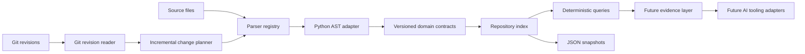

# NEXUS architecture

## Purpose

NEXUS will provide structured repository facts to developer workflows and AI tools. The system should be able to answer questions such as which symbols depend on a changed function, which tests cover an affected module, and which repository files provide the evidence for an answer.

The architecture is intentionally staged. The implemented foundation establishes
deterministic repository facts before retrieval or model providers are added.

## System view



The solid path through the parser, contracts, index, and snapshots is currently
implemented. The evidence and AI adapter nodes are explicit extension points,
not completed features.

## Boundaries

```text
Repository input --> Git revision reader --> incremental planner
                                  |
                                  v
                         parser registry
                                  |
                                  v
                         language adapter
                                  |
                                  v
                    normalized domain contracts
                         |                    |
                         v                    v
                  repository index      JSON snapshot
                         |
                         v
                 deterministic queries
```

### Git revision reader and incremental planner

`GitRevisionReader` isolates subprocess execution and parses revision changes
into typed file-change records. `plan_incremental_update` classifies paths as
added, changed, removed, or unchanged. Applying a plan removes stale facts
before replacement facts are added.

### Parser registry and adapters

`ParserRegistry` selects an adapter by language. The current adapter is
`PythonParserAdapter`, which uses the standard-library AST module. Adapters
return normalized parser contracts and do not write to the index directly.

### Normalized domain model

Defines stable records for repositories, files, symbols, and relationships. Downstream indexes and graph queries consume these records instead of language-specific parser objects.

### Index and query layer

`RepositoryIndex` stores source files, symbols, relationships, and diagnostics in
memory. It supports exact symbol lookup and relationship queries. Relationship
records are the current graph foundation; broader traversal and cross-file
resolution remain planned.

### Snapshot boundary

`nexus.snapshot.v1` serializes the index into deterministic JSON. Snapshot
loading validates the schema before restoring an index. This keeps persistence
explicit while storage requirements are still being measured.

### Future evidence and AI tooling adapters

Future AI features will call typed query interfaces and receive evidence that
identifies relevant files, symbols, and relationships. Model providers must
remain outside the core indexing and graph logic. Neither the evidence layer
nor provider integration is implemented yet.

## Current vertical slice

The first functional slice is intentionally narrow:

1. Read a checked-in or caller-provided source file.
2. Build a validated source-file contract.
3. Parse Python into deterministic symbols and syntactic relationships.
4. Add the parser output to an in-memory repository index.
5. Query or serialize the resulting facts.
6. Exercise the behavior with unit, golden-evaluation, benchmark, and load-test harnesses.

No vector database, external model provider, hosted service, or production deployment is part of this slice.

## Reliability principles

- Parsing results must be deterministic for the same input revision.
- Unsupported files must be reported explicitly rather than silently treated as parsed.
- A parser failure for one file must preserve diagnostics and avoid corrupting records for unrelated files.
- Domain records should carry source locations so later answers can cite evidence precisely.
- Incremental indexing will be introduced only after full indexing has correctness fixtures.

## Current status

The parser, contracts, index, Git change discovery, snapshots, and local
evaluation harnesses are implemented. Persistent storage, cross-file semantic
resolution, retrieval, evidence construction, and AI integrations remain
planned. See [ADR 0001](decisions/0001-deterministic-core-first.md) and
[ADR 0002](decisions/0002-explicit-boundaries-and-deterministic-evidence.md)
for the main architectural decisions.
